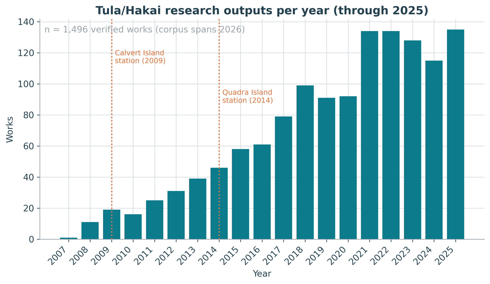
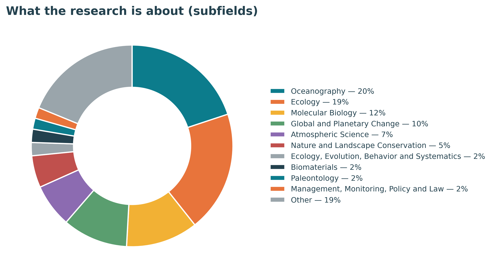
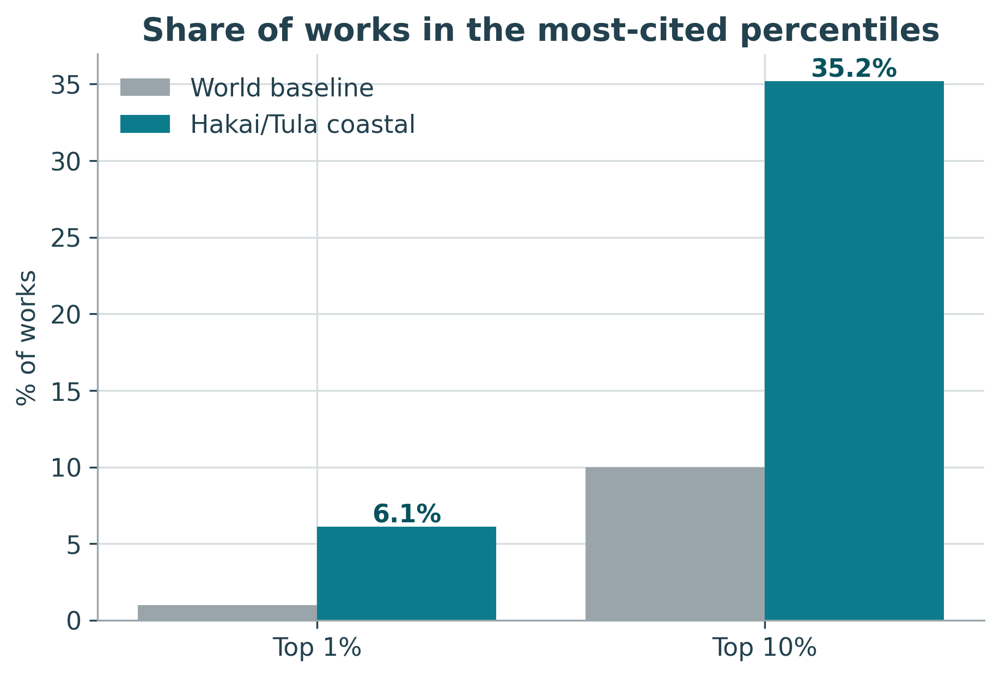
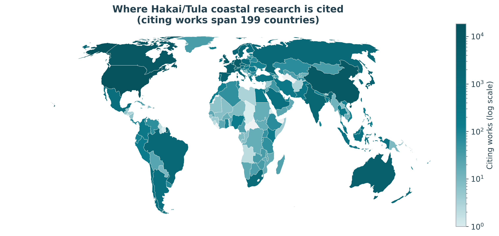
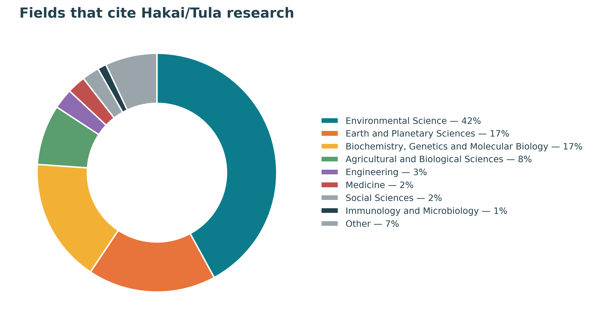
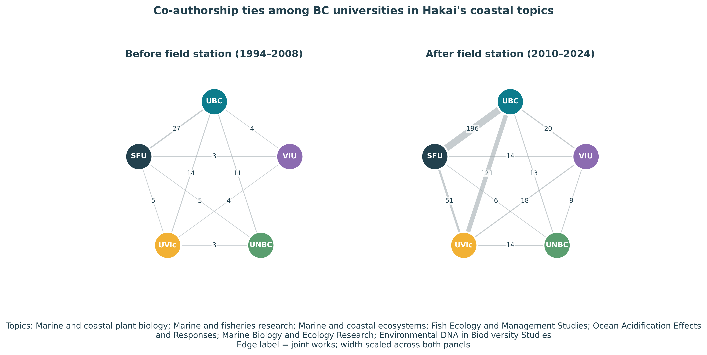
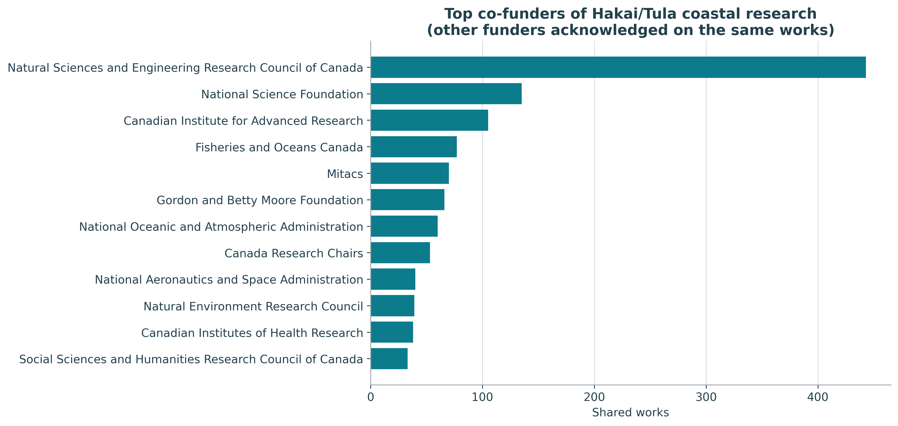
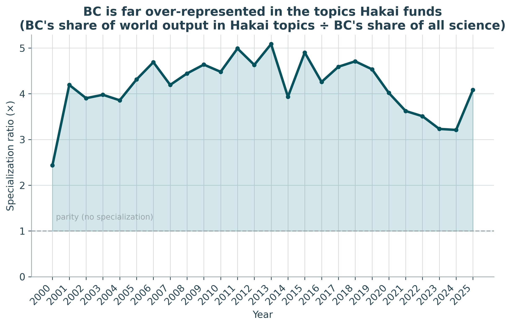
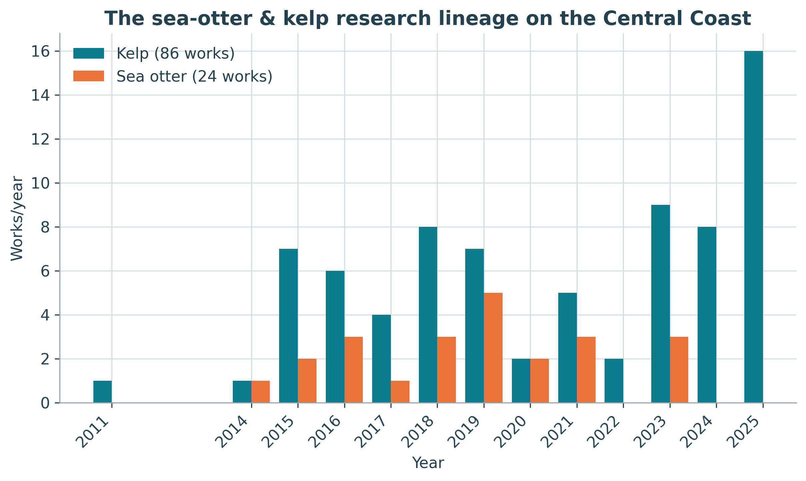

> **TL;DR.** As part of a Wellcome-funded effort to build open funding metadata into OpenAlex, I
> assembled research outputs I could tie to the Tula Foundation and its Hakai Institute, the
> Canadian funder where I got my start in research management and strategy. The result is 1,496
> research works (overwhelmingly coastal and environmental science), cited 58,000+ times by
> research from 199 countries and every field of science, with more than 6% in the world's top
> 1% most-cited papers. The work runs from a 13,000-year-old discovery on a BC beach to the
> pathogen behind a continent-wide ecological collapse; it's co-acknowledged alongside 500+
> other funders; and it shows BC universities working across institutional silos. This is a
> story about a remarkable funder and a demonstration of what is now possible with open research
> funding data integrated into OpenAlex.

## Measuring what funders make possible

For the past year at OpenAlex, I've been leading a Wellcome-funded project to build out open
funding metadata and to connect the world's research to the funders who made it possible, as open
data anyone can use. We've now made enough progress that I wanted to put it through the test of a
real case study. I chose one close to home: the Tula Foundation and its Hakai Institute, the
British Columbia funder that launched my career in research management and strategy.

The Tula Foundation was founded in 2001 by Eric Peterson and Christina Munck, after Eric sold his
medical-imaging company. With those resources, they did something ambitious: they built two
world-class marine research stations: one on Calvert Island, on the wild Pacific edge of the
Great Bear Rainforest, and one on Quadra Island in the Salish Sea. Rather than issue smaller
grants to researchers at universities, they aspired to bring scientists together across
university and sectoral silos to focus on place-based research on British Columbia's Central
Coast, in collaboration with the First Nations whose territories span the region. The Calvert
lodge was acquired in 2009 and opened the following spring; the Hakai Institute (for a time the
"Hakai Beach Institute," and earlier administered as the "Hakai Network") grew from there.

Tula's work reaches well beyond the coast, including other important initiatives like TulaSalud,
a maternal- and child-health program in Guatemala. But the coastal science is the part I know
best, because I lived a chapter of it, and so I focus on that aspect of their work here.

## My chapter

After finishing my PhD at UBC, I was hired as a postdoc in Anne Salomon's lab at Simon Fraser
University, funded through the Hakai Network. My job was to design a kelp-forest monitoring
protocol for the Central Coast (the first long-term baseline of its kind there) built to be
interoperable with monitoring initiatives elsewhere in BC (like Haida Gwaii) but also aimed
squarely at a question that was rewriting the coast in real time: what happens as sea otters
return after decades of local extinction? I ran a dive team out of the Calvert Island station for
two field seasons, and supported the work of trainees like Jenn Burt and Christine Stevenson, who
have since launched successful careers in the field.

As my postdoc wound down, I was interviewing for faculty jobs and was conflicted about my future,
not wanting to leave BC, which had become my home. Around the same time, Eric was rethinking how
to best mobilize Tula's resources to move coastal research forward. Because I already knew
researchers across the BC universities and was familiar with his vision, he offered me a
full-time role building Hakai's in-house research administration: designing better ways to
partner with universities, and exploring collaborative models with government, industry, other
funders, and NGOs.

I was in that job less than a year. But the entrepreneurial spirit of the organization and the
founders' ambition and mission-focus gave me a unique crash course in research management,
specifically: how to align the incentives of researchers and institutions with a mission (which
are often orthogonal) to produce real impact. These experiences became the foundation of
everything I've done since and motivate my work at OpenAlex today, supporting research globally
with an open index of the world's research ecosystem.

You can probably read from my tone that I am not a neutral observer in this story, but I see that
as an excellent opportunity to test the state of OpenAlex's funding data.

## Finding the corpus: casting a wide net

Here's the first hard problem, and it's a general one for funder analyses: you cannot just look
up a funder and expect the list to be completely accurate and comprehensive.

Tula and Hakai aren't always acknowledged the way a federal funding agency is in publications.
Conventions changed over two decades; some researchers name "Hakai Institute" as an affiliation
rather than in an acknowledgements section; closed-access papers may carry no machine-readable
funding; Hakai publishes open datasets, not only papers; and as I mentioned above Tula supports
great initiatives outside of the mission of the Hakai Institute. A single funder lookup would
miss some outputs and include others that don't fit the scope of the analysis.

So I cast a deliberately wide net using nine complementary search strategies in OpenAlex:

| Strategy | What it catches |
|---|---|
| Funder = Hakai Institute / Tula Foundation | Explicit funder acknowledgements and linkages asserted in Crossref |
| Affiliation = Hakai Institute / Tula Foundation | Authors who list Hakai/Tula as one of their institutions |
| Raw affiliation string "Hakai" | Affiliations OpenAlex hasn't yet linked to an institution |
| Full-text "Hakai Institute" / "Hakai Network" / "Tula Foundation" | Mentions in the open full text |
| Full-text "Calvert Island" | Work done at the field station, however acknowledged |
| Datasets | Hakai-published open data |

That produced 1,684 candidate works but casting a wide net means catching some fish you didn't
want, which is exactly why the next step matters. [To those who are annoyed by unnecessary marine
puns: sorry, I just couldn't help myself]

### Verifying every candidate

I ran an LLM over all 1,684 candidates (title, abstract, venue, affiliations, provenance) to
judge whether each was genuinely Tula/Hakai work, then hand-checked every exclusion. 170 were
false positives. A few illustrate why the step is essential: a protein called Hakai (CBLL1, named
for the Japanese word for "destruction") that full-text matching brought in; the Russian city of
Tula and its universities; and one was a 1985 oceanography paper tagged to a funding organization
that wouldn't exist for another sixteen years.

That left 1,514 genuine Tula/Hakai works. The analysis below covers 1,496 of them that are
overwhelmingly coastal and environmental science, plus Tula's marine-microbial, earth-science,
and related research. Setting aside only the clinical and behavioural papers (Medicine,
Psychology, Neuroscience) relating to TulaSalud as off-topic for this analysis.

> **The real point here.** Open funder metadata is now good enough to find a funder's footprint
> across journals, repositories, and full text. Broad open metadata plus a verification pass is
> what makes a study like this possible. A few years ago, it wasn't. And later this year, users
> will be able to submit the types of curations I made during this analysis directly to OpenAlex!

**A note on precision and recall.** For those who are interested: precision — the share of
candidates that turned out to be genuine — was 90%, and recall — measured against Hakai's public
publication list (356 valid DOIs; <https://hakai.org/publications>) — was 89%. The ~11% the search
misses are works with no funder acknowledgement, no Hakai affiliation, and no searchable full
text — the frontier that direct, funder-asserted linkages are built to close.

## What the funding produced

1,496 verified Tula/Hakai research works, spanning effectively 2007 to today, from 4,742 authors
at 1,200+ institutions in 85 countries. ~80% are open access. Over 100 are open datasets.

That ~80% open-access share is well above the global average (about 47% of research published
2015–2024). That isn't an accident. In 2015, Hakai adopted an open-science policy (one I helped
implement) requiring open data and publications. Funders are one of the most powerful levers for
open science: when the Gates Foundation made immediate open access a condition of its grants,
compliance followed across the fields it funds and other funders were empowered to make similar
policies. Hakai's policy is a small, early example of the same dynamic, and it shows up directly
in how discoverable and reusable this body of work is today.

*Annual outputs climb from a handful before the field stations to well over 100 a year; the
dotted lines mark the Calvert (2009) and Quadra (2014) field stations.*

The work is overwhelmingly environmental and marine science and the single most common topic is
marine and coastal plant biology (read: related to seaweeds, seagrasses, and their ecosystems).
Works are published in venues like Frontiers in Marine Science, Marine Ecology Progress Series,
The ISME Journal, Proceedings of the Royal Society B, and PNAS.

*Subfields of the corpus (top 10; the long tail is grouped as "Other").*

## Citations: punching above weight

Counting papers is the easy part. The more interesting question is whether anyone built on the
knowledge produced and shared through those outputs. They did, of course: the corpus has been
cited 58,579 times.

The standard field-normalized measure is Field-Weighted Citation Impact (FWCI), where 1.0 is the
world average for a paper of the same age, field, and type. People like FWCI because it allows
comparisons across very different outputs and that's why FWCI underpins university rankings and
many institutional research intelligence use cases. But averaged FWCI is notorious for being
heavily right-skewed: a handful of very highly cited papers can pull the mean far above the
typical paper. Here the mean FWCI is 6.94 but that is inflated by a few giant consortia papers.
Data from the Central Coast of BC are only able to be included in mega-authored global syntheses
because of the Hakai Institute, and so it's important to still value Hakai's contributions to
those highly cited initiatives, but the median and the percentile shares are more robust here:

- Median FWCI: 1.69 — the typical Hakai/Tula paper is cited ~69% more than its global peers.
- 62.5% of works are above the world average.
- 92 works (6.1%) sit in the world's top 1% most-cited — 6.1× the expected rate.
- 526 works (35.2%) are in the top 10% — 3.5× the expected rate.

*The corpus is ~6× over-represented in the world's top 1%, and ~3.5× in the top 10%.*

## What was the science?

Citation metrics tell you that people built on the work; they don't tell you what the work was.
So I pulled the 50 highest-FWCI works to understand the work and its impact better. It was
surreal to read about some of the incredible discoveries that came from the Calvert Island field
station while reflecting on the memories I built there with other researchers:

- **The sea stars, the mystery, and the answer.** Starting in 2013, sea stars from Alaska to
  Mexico melted away in the largest marine wildlife die-off ever recorded. A Hakai-linked team
  documented the continent-scale collapse of the sunflower sea star (*Pycnopodia*), tied to a
  marine heat wave (2019). The loss rippled straight into my world: fewer sea stars and otters
  means more urchins, and more urchins meant less kelp. Then, after a decade-long hunt by
  scientists globally, a 2025 paper in the corpus named the culprit, the bacterium *Vibrio
  pectenicida*, finally giving the disease a cause.
- **A 13,000-year-old morning on Calvert Island.** Among the highest-impact papers (FWCI 93) is
  the discovery of terminal-Pleistocene human footprints pressed into the shoreline of Calvert
  Island, representing direct evidence for the peopling of the Americas along a coastal route. The
  field station didn't only host marine biology; it helped rewrite an understanding of human
  history.
- **Kelp forests, globally.** The corpus includes the definitive syntheses of global kelp-forest
  change over the past half-century and the economic value of the world's kelp forests. This is
  the big-picture context for exactly the monitoring I was sent to Calvert to build.
- **The invisible ocean.** Tula's marine-microbial program produced landmark work on microbial
  and viral "dark matter" and the evolutionary origin of plastids, the hidden machinery of ocean
  ecosystems.
- **Filling a blank spot in the global picture.** Some of the highest-FWCI works are large
  climate syntheses (e.g., the Global Carbon Budget series, a multi-decade ocean-CO₂ record) where
  Hakai is one of many contributors. That's not a footnote to discount. Coastal British Columbia
  was historically underrepresented in global ocean and carbon models; Hakai's sustained
  observations are the only reason that this region appears in those worldwide analyses at all.
  Putting a blank spot on the map is its own kind of impact.
- **Science with, not about, communities.** Several top papers are Indigenous-led, Haida and
  Haíɫzaqv ethics and oral history guiding ecological restoration, reflecting how the work is done
  on this coast.

The point: the impact numbers aren't abstract. They're footprints, sea stars, and kelp.

## How far does the work travel?

This is my favourite analysis, and it's only possible because OpenAlex maps the full citation
graph. I took every paper that cites the corpus and asked where, and in what fields, those citing
papers come from.

The answer: research from 199 countries and all 26 fields of science has cited this coastal work.
A program run from two islands on the BC coast is being built upon on every continent.

*Every shaded country has published research citing this corpus; colour is on a log scale.*

## Breaking the silos

Tula's bet wasn't only on papers; it was on a place where people from different organizations
would work side by side. Does the data show it?

I looked at co-authorship among five BC universities (UBC, SFU, UVic, UNBC, and VIU) restricted to
Hakai's focus coastal topics (kelp and coastal plant biology, fisheries, coastal ecosystems, fish
ecology, ocean acidification, marine biology, and environmental DNA). Comparing two equal 15-year
windows around the field station's 2009 opening, cross-university co-authorship links in these
topics grew from 76 before (1994–2008) to 462 after (2010–2024), roughly a sixfold rise. UBC–SFU
joint coastal papers alone went from 27 to 196. A rich body of research exists showing the
benefits of collaboration across institutions, but institutional incentives restrict this type of
collaboration. Without organizations like Tula/Hakai creating incentives for collaboration, they
tend not to happen, despite the increased impact such collaborations can produce.

Crucially, that's not just more papers. Total BC output in these topics grew ~2.7× over the same
period, but collaboration links grew ~6× — so collaboration intensity (links per BC coastal
paper) more than doubled, from 0.06 to 0.13. The universities didn't only publish more; they
published together more.

*Co-authorship ties among the five BC universities in Hakai's coastal topics (listed beneath the
figure). Before the field stations (left) the universities barely co-published in this space;
afterward (right) the ties thicken dramatically.*

## Amplifying other funders' investments

Research rarely has a single funder. When I grouped the corpus by every funder acknowledged on
each paper, I found 537 distinct co-funders beyond Tula/Hakai (excluding universities' own
internal grants):

Canada's NSERC appears on 388 of these works; the US National Science Foundation on 127; CIFAR,
Fisheries and Oceans Canada, and Mitacs on ~70–80 each; and a long international tail including
NOAA, NASA, the UK's NERC, the Gordon and Betty Moore Foundation, and the Pacific Salmon
Foundation. (NASA is there because Hakai's satellite-based kelp mapping leverages Landsat imagery
to map coastal resources.)

These mostly aren't formal partnerships between Tula/Hakai and, say, NSERC. They're something
quietly valuable: Tula-supported researchers, field stations, and long-term datasets enabling work
that other funders also backed so that a single project advances several funders' missions at
once. A trained scientist or a decade-long dataset makes the public dollars flowing through NSERC,
NSF, DFO, or NOAA reach further than they could alone. Open funding metadata lets any funder see,
and show, that amplifying effect directly.

## What bibliometrics can and can't tell you

It's tempting to look for a clean before-and-after spike when the field stations opened in 2009
and call it "Tula's effect." Analysis won't support that and the reason is instructive about the
method itself. BC was already a global leader in marine science (that's what drew me here
originally), and also because Tula's impact in this space began earlier than the Hakai Institute,
in the 2000s. A place-based funder embedded in an already-strong region simply cannot be cleanly
isolated with this approach.

What the data can show robustly, is specialization. BC produces about 1.2% of the world's output
in Hakai's focus topics but only ~0.3% of science overall, meaning BC is 4× more present in
exactly the topics Hakai funds than in research at large, and has been since the early-grant era.
BC's annual output in these topics grew from 61 papers in 2000 to ~272 a year recently.

*BC is consistently 4–5× over-represented in the topics Hakai funds, relative to its overall share
of science.*

That's the right altitude for this kind of analysis. Bibliometrics can map a footprint and its
concentration with confidence; it cannot, on its own, prove what caused it. Being clear about that
line is part of using funder data well.

And these analyses are useful well beyond telling one funder's story. The same open data lets a
funder run a landscape analysis of its own portfolio; it helps funders read the broader landscape
to find others with overlapping missions for large-scale collaboration; and it supports gap
analyses that reveal promising areas with little funding. Open funder metadata turns work that
used to be a bespoke consulting engagement or a subscription to a proprietary database into
something any funder can do.

## The part the bibliometrics miss

I want to be clear about the limits of everything above. The true impact of Tula's funding is much
larger than papers. The field stations supported local and First Nations economies, created jobs
on the BC coast, trained leaders in coastal ecology, and underpinned Indigenous-led monitoring and
stewardship. Tula also funded important work outside the scope of this analysis (like TulaSalud's
community health program in Guatemala) which were omitted here and whose true impact barely appears
in the citation record at all, because that kind of impact mostly doesn't get published in indexed
journals. Bibliometrics are a shadow of the whole. I'm showing you the shadow because it's what
the data in OpenAlex and other bibliometric databases can describe, not because it's the whole
figure.

## Careers, including mine

Here's something no citation count fully captures. The Calvert Island station didn't only produce
papers, it produced people. Over the years it trained and launched a generation of coastal
scientists: graduate students, postdocs, dive technicians, data managers, etc., many of whom now
lead research and conservation at universities, government agencies, NGOs, and the Institute
itself. Properly tracing all of those careers would be a study in its own right. Here, I'll just
say the pattern is unmistakable to anyone who knows the people. [Maybe next year, I'll try to get
a list of all the trainees and track their careers as another case study.]

The sea-otter-and-kelp question that brought me to Calvert is one small example of the
through-line: it seeded a whole research lineage with 86 kelp papers (2,500+ citations) and 24
sea-otter papers in this corpus alone.

And me? The crash course Eric and Christina gave me in how research actually gets supported, and
how collaborations are built around missions, is the reason I'm writing this from OpenAlex instead
of a faculty office. A funder's impact includes the careers it shapes, including my own.

## Why I could do this now — and an invitation

A few years ago, this study would have been a months-long manual slog of reading acknowledgements
sections. Today, open funding data in OpenAlex (funder IDs, linked affiliations, full-text search,
the complete citation graph, datasets, FWCI and percentiles, etc.) let me assemble, verify, and
analyze a funder's entire research footprint in a single day, with every step reproducible and
every work's provenance recorded. The scripts and data behind every number here are open.

It also showed me where the work still is: entity resolution strategies that conflate a foundation
with a gene, institutions that over-match a common place name, conventions that vary across
decades. That's exactly the kind of curation this Wellcome-funded project is built to improve and
where funders themselves can help, by connecting their own data.

If you're a research funder (agency or foundation, large or small) and you'd like to understand
your research footprint with open, transparent metadata, I'd love to talk. This is what open
funder data makes possible, and we're just getting started.

---

*Full methods, code, data, and figures are in the
[project repository](https://github.com/ourresearch/openalex-walden/tree/main/plans/awards/examples/tula-hakai-funder-impact).
Funder background drawn from the Tula Foundation and Hakai Institute, with reporting by The Globe
and Mail and The Narwhal.*
