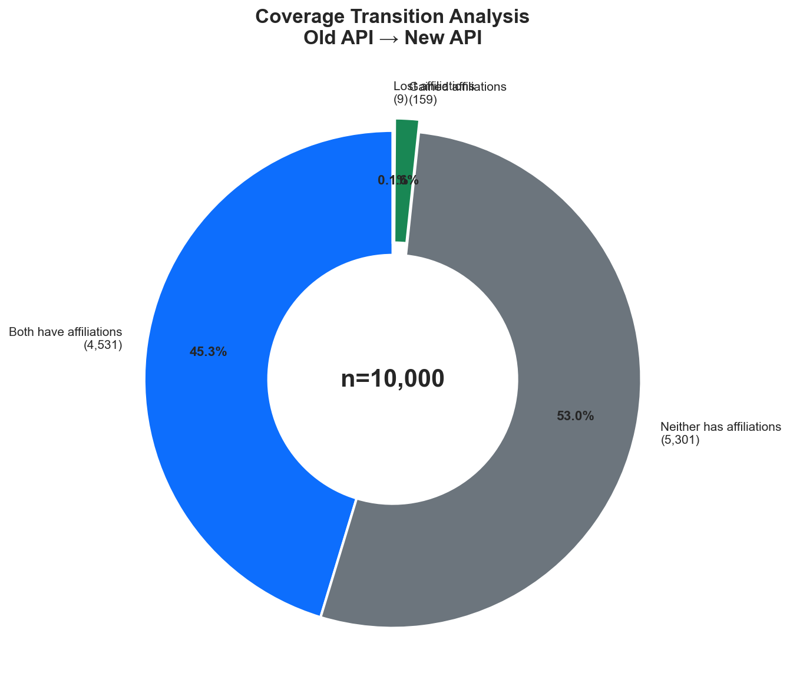
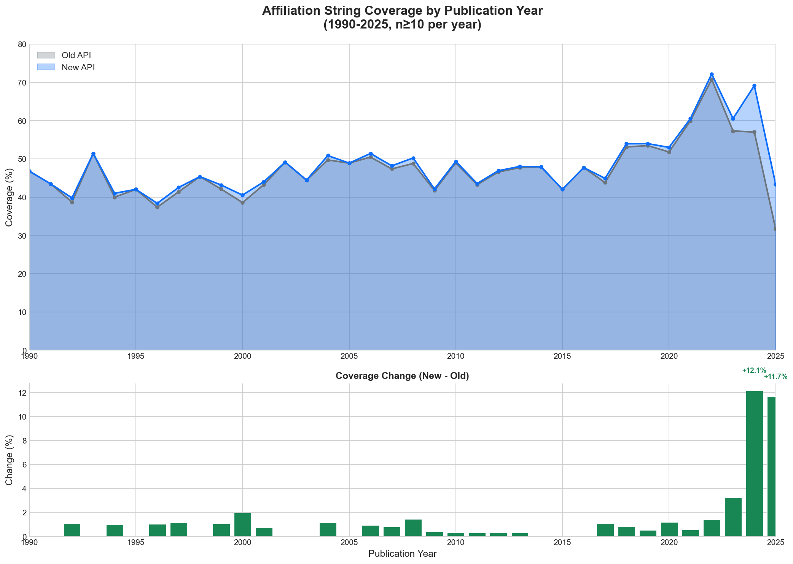
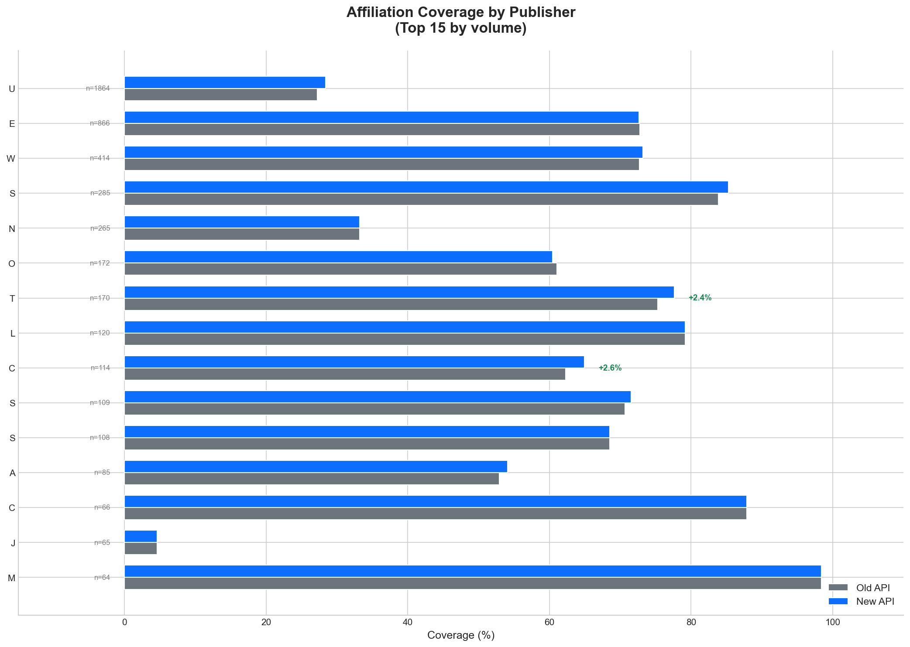
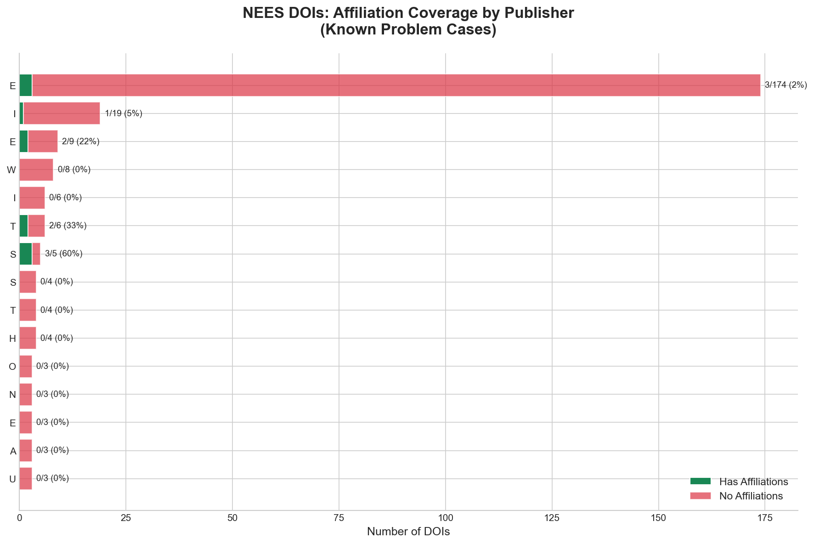

# OpenAlex API Affiliation String Coverage Analysis

**Report Date:** January 9, 2025
**Datasets:** 10K Random Sample + NEES DOIs (316 known problem cases)

---

## Executive Summary

The new OpenAlex API shows **modest overall improvement** in affiliation string coverage with **significant gains in recent publication years**.

| Metric | Value |
|--------|-------|
| Overall improvement | **+1.50%** |
| Net works gained | **+150** |
| 2024 improvement | **+12.1%** |
| 2025 improvement | **+11.7%** |

---

## 1. Overall Coverage Comparison

### Summary Statistics

| Metric | Old API | New API | Change |
|--------|---------|---------|--------|
| **Total Works** | 10,000 | 10,000 | — |
| **Works with Affiliations** | 4,540 | 4,690 | **+150** |
| **Coverage Rate** | 45.40% | 46.90% | **+1.50%** |

---

## 2. Transition Analysis

### What Changed?

| Category | Count | Percentage |
|----------|-------|------------|
| ✅ Both have affiliations | 4,531 | 45.3% |
| ⚪ Neither has affiliations | 5,301 | 53.0% |
| 🟢 **Gained affiliations** | 159 | 1.6% |
| 🔴 Lost affiliations | 9 | 0.1% |

**Net Change:** +150 works

---

## 3. Coverage by Publication Year

### Key Observations

- **Recent years show significant improvement** — The new API has better coverage for 2023-2025 publications
- **Historical data largely unchanged** — Pre-2020 coverage remains stable
- **2024 shows the largest gain** — +12.1% improvement

---

## 4. Recent Years Detail (2020-2025)

### Year-by-Year Breakdown

| Year | Sample Size | Old Coverage | New Coverage | Δ |
|------|-------------|--------------|--------------|---|
| 2020 | 417 | 51.8% | 53.0% |  **+1.2%** |
| 2021 | 362 | 59.9% | 60.5% |  **+0.6%** |
| 2022 | 356 | 70.8% | 72.2% |  **+1.4%** |
| 2023 | 370 | 57.3% | 60.5% | 🟢 **+3.2%** |
| 2024 | 321 | 57.0% | 69.2% | 🟢 **+12.1%** |
| 2025 | 429 | 31.7% | 43.4% | 🟢 **+11.7%** |

---

## 5. Coverage by Publisher

### Top Publishers with Notable Changes

| Publisher | n | Old | New | Δ |
|-----------|---|-----|-----|---|
| Unknown | 1,864 | 27.2% | 28.4% |  +1.2% |
| Elsevier BV | 866 | 72.7% | 72.6% |  -0.1% |
| Wiley | 414 | 72.7% | 73.2% |  +0.5% |
| Springer Science+Business Media | 285 | 83.9% | 85.3% |  +1.4% |
| National Institutes of Health | 265 | 33.2% | 33.2% |  +0.0% |
| Oxford University Press | 172 | 61.0% | 60.5% |  -0.6% |
| Taylor & Francis | 170 | 75.3% | 77.6% | 🟢 +2.4% |
| Lippincott Williams & Wilkins | 120 | 79.2% | 79.2% |  +0.0% |
| Cambridge University Press | 114 | 62.3% | 64.9% | 🟢 +2.6% |
| Springer Nature | 109 | 70.6% | 71.6% |  +0.9% |
| SAGE Publishing | 108 | 68.5% | 68.5% |  +0.0% |
| American Chemical Society | 85 | 52.9% | 54.1% |  +1.2% |
| RELX Group (Netherlands) | 64 | 65.6% | 92.2% | 🟢 +26.6% |
| European Organization for Nuclear Resear... | 59 | 50.8% | 59.3% | 🟢 +8.5% |

### Notable Improvements

- **RELX Group**: +26.6% — Major improvement, possibly new data partnership
- **European Organization for Nuclear Research**: +8.5%
- **Cambridge University Press**: +2.6%
- **Taylor & Francis**: +2.4%

---

## 6. NEES DOIs Analysis

The NEES dataset contains **316 DOIs** that were specifically identified as problematic cases where affiliations exist in source HTML but were not captured by OpenAlex.

### NEES Summary

| Metric | Value |
|--------|-------|
| Total DOIs | 316 |
| Found in API | 315 (99.7%) |
| **Has Affiliations** | **18 (5.7%)** |

### Why So Low?

These DOIs were **intentionally selected as failure cases** where:
- Affiliations are visible on publisher landing pages
- But OpenAlex's data extraction pipeline doesn't capture them
- Primary cause: Publisher-specific HTML structures not supported

### NEES by Publisher

| Publisher | DOIs | Has Aff | Coverage |
|-----------|------|---------|----------|
| Elsevier BV | 174 | 3 | 1.7% |
| IOP Publishing | 19 | 1 | 5.3% |
| Emerald Publishing Limited | 9 | 2 | 22.2% |
| Wiley | 8 | 0 | 0.0% |
| Institute of Physics | 6 | 0 | 0.0% |
| Taylor & Francis | 6 | 2 | 33.3% |
| Springer Science+Business Media | 5 | 3 | 60.0% |
| SAGE Publishing | 4 | 0 | 0.0% |
| Thieme Medical Publishers (Germany) | 4 | 0 | 0.0% |
| Hindawi Publishing Corporation | 4 | 0 | 0.0% |

---

## 7. Key Takeaways

### ✅ Wins

1. **Overall coverage improved by 1.50%** (+150 works)
2. **Recent publications (2024-2025) show significant gains** — New data pipelines are working
3. **RELX Group dramatically improved** (+26.6%) — Suggests new data source or partnership
4. **Very few regressions** — Only 9 works lost affiliations

### ⚠️ Areas of Concern

1. **NEES DOIs remain largely uncovered** — Only 5.7% have affiliations
2. **Elsevier dominates NEES failures** — 174 DOIs, mostly without affiliations
3. **Historical data unchanged** — No backfill of older publications

### 📋 Recommendations

1. **Investigate Elsevier extraction** — 55% of NEES failures are Elsevier
2. **Monitor RELX improvement** — Understand what changed and apply elsewhere
3. **Consider historical backfill** — Pre-2020 data shows no improvement

---

## Methodology

- **10K Random Sample**: Random selection of OpenAlex work IDs
- **NEES DOIs**: 316 DOIs identified as having affiliations in source HTML but not in OpenAlex
- **Old API data**: Previously cached responses from OpenAlex API
- **New API data**: Fresh queries to OpenAlex API (January 9, 2025)
- **Affiliation detection**: Work has ≥1 author with ≥1 non-empty `raw_affiliation_string`

---

*Report generated automatically by `generate_coverage_report.py`*
